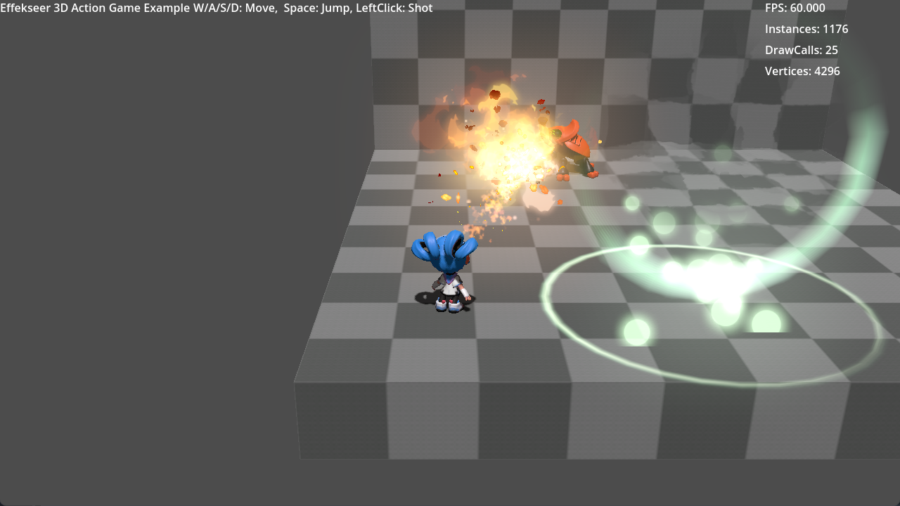

# Effekseer for Godot4: Features demos


# How to run in Godot4

Get the latest addon with the following command.

```
python3 get_latest_plugin.py
```

Next, open `project.godot` in Godot4

# Asset License:
The following assets are from [here](https://github.com/gdquest-demos/godot-4.0-new-features).

- shared/models/**

CC-By 4.0 GDQuest.
